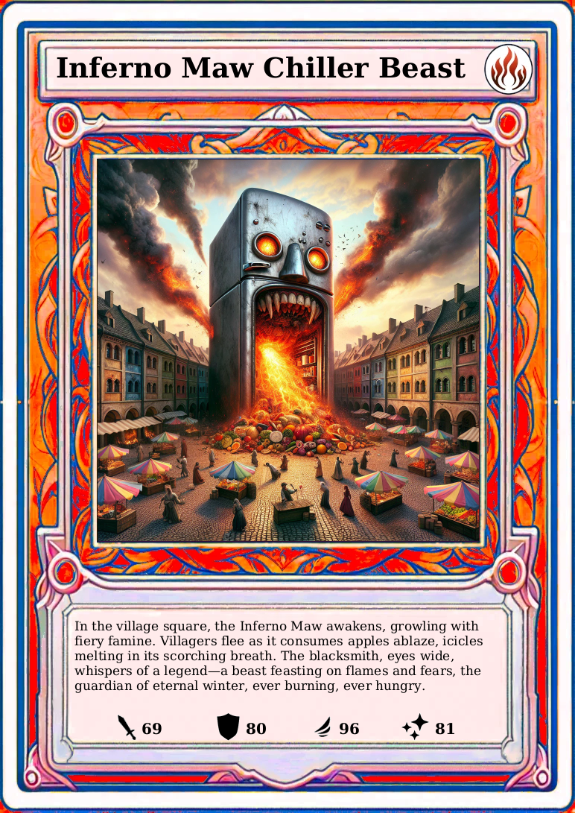
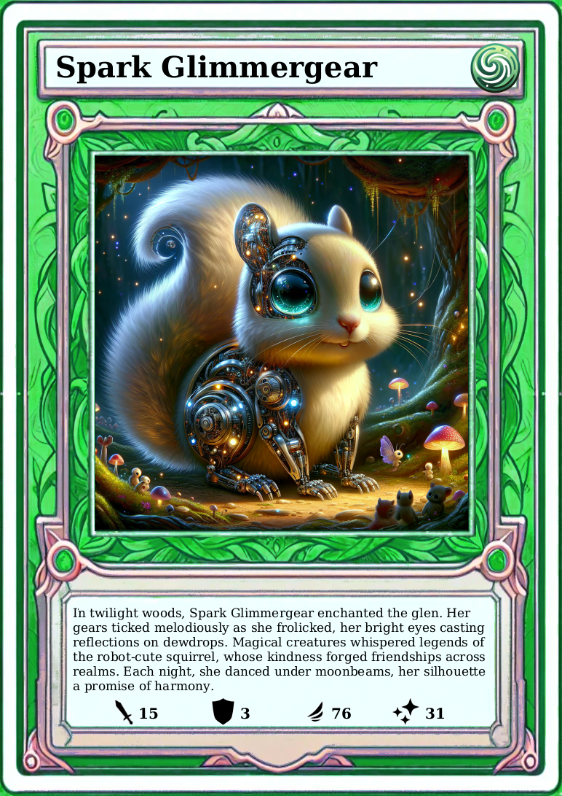
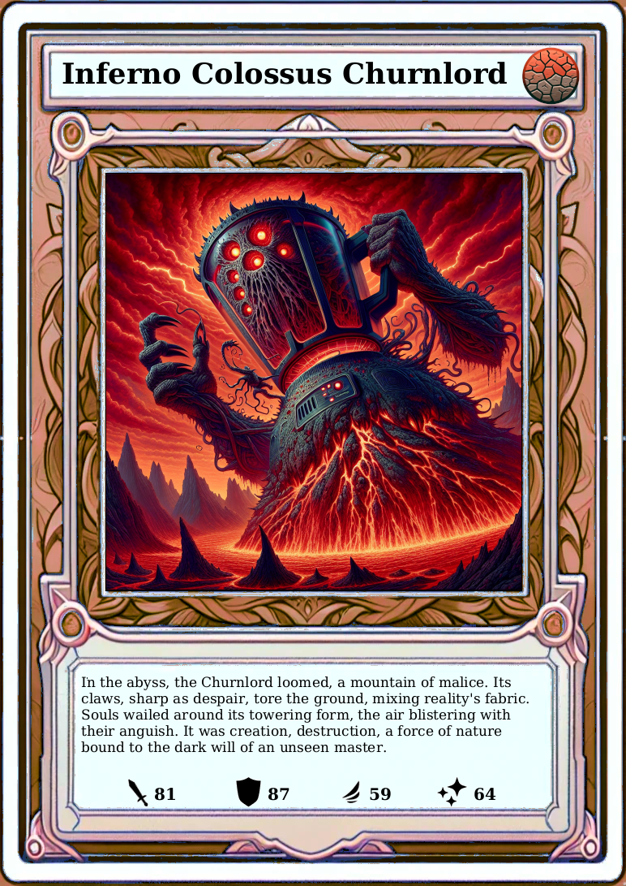
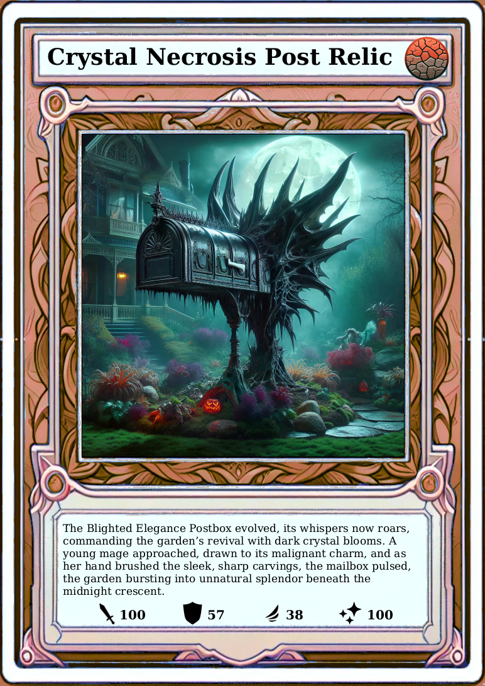
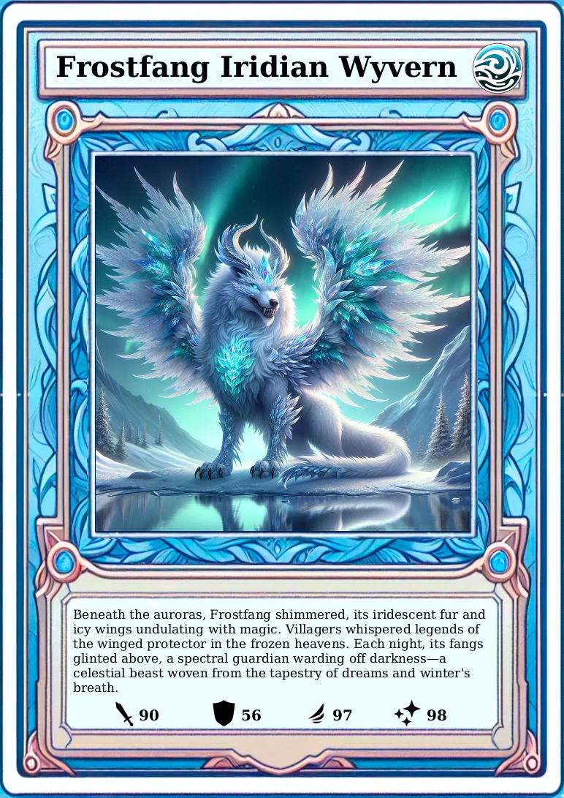
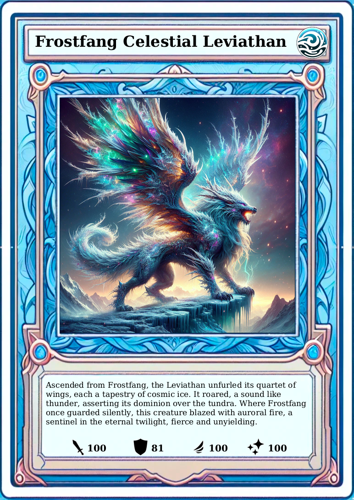

<h1 align="center" style="font-weight: normal;">tr<b>AI</b>ding-cards-gallery</h1>

An AI generated trading card game.

<a href="https://csti.haw-hamburg.de/2023/11/21/digital-science-night-5-generation-ai-ich-bin-doch-nur-ein-language-model/">This project was part of the 2023 Digital Science Night</a>

<a href="https://github.com/ansemjo/diffusionbooth">DiffusionBooth</a> | <a href="https://github.com/okafke/trAIding-cards">tr<b>AI</b>ding-cards</a> | tr<b>AI</b>ding-cards-gallery

Are 151 Pokémon not enough for you?
Ever wanted to see what a hungry fridge on fire looks like?
A demonic post box?
Or the Kitchen Mixer Overlord? 
Let your imagination run wild: tr<b>AI</b>ding-cards uses Dall-E and ChatGPT to create cards for you.

    
    
    

    
    
    

